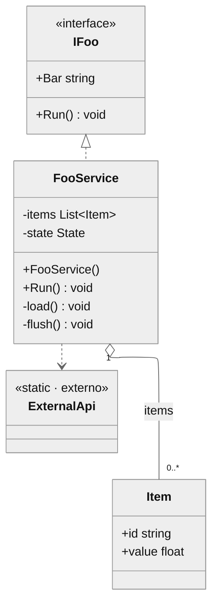

# Estilo do diagrama de classes (Mermaid)

O diagrama vai **embutido no `.md`** como bloco ` ```mermaid ` (renderiza no
GitHub e no VS Code) e o script de render o transforma em SVG vetorial no PDF e
extrai a cópia `.mmd`. Um diagrama por doc, dentro da seção 3 (Arquitetura).

## Regra de ouro: caixas magras

O motivo nº 1 de diagrama ilegível é **descrição enfiada dentro da caixa**, que
incha os nós e faz as linhas se cruzarem. As descrições de campo/método moram nas
**tabelas da seção 4 do doc**, não no diagrama. No diagrama, só assinaturas. Caixa
magra → o layout ELK tem espaço → linhas ortogonais sem cruzar.

## Esqueleto

````markdown

````

O bloco `---config: layout: elk---` é o que troca o layout dagre (que cruza
linhas) pelo **ELK** (roteamento ortogonal, contorna as caixas). É essencial —
não omita.

## Convenções

- **Assinaturas, não prosa.** `+Run() void`, não `+Run() void — faz tal coisa`.
- **Visibilidade:** `+` público, `-` privado, `#` protegido.
- **Estereótipos** na própria linha dentro da classe: `<<interface>>`,
  `<<enumeration>>`, `<<abstract>>`, `<<singleton>>`. Para algo externo ao sistema
  (API de framework, lib), use `<<externo>>` ou `<<static · externo>>` e agrupe
  esses nós no rodapé visual.
- **Enums:** `class Tipo { <<enumeration>>\n  ValorA\n  ValorB }`.
- **Genéricos** com til: `List~Item~`, `Dictionary~string,float~`. Não use `<` `>`
  (quebram o parser).
- **Sem o marcador `$` de estático** se houver texto depois — ele vaza como `$`
  literal. Prefira o estereótipo `<<static>>` na classe.

## Relações

| Sintaxe | Significado |
|---|---|
| `A <\|.. B` | B implementa a interface A (realize) |
| `A <\|-- B` | B herda de A |
| `A "1" o-- "0..*" B : campo` | A agrega B (composição fraca), com multiplicidade e rótulo |
| `A "1" *-- "1..*" B : campo` | A compõe B (composição forte) |
| `A ..> B` | A depende de B (usa, chama) |
| `A --> B` | associação dirigida |

Rotule as relações de agregação com o nome do campo (`: items`) e ponha
multiplicidade nas pontas (`"1"`, `"0..*"`). Dependências para externos podem
ficar sem rótulo para não poluir.

## Mantendo legível

- **Agrupe os externos** num canto: declare-os por último. ELK tende a empurrá-los
  para a borda.
- Se ainda houver cruzamento, quase sempre é caixa gorda — volte e mova texto pras
  tabelas do doc.
- `direction TB` (cima→baixo) é o padrão para diagrama de classes; só troque para
  `LR` se o sistema for muito mais largo que alto.
- Um diagrama por doc. Se o sistema for grande demais para um diagrama, ele
  provavelmente são dois sistemas — faça dois conjuntos de arquivos.
